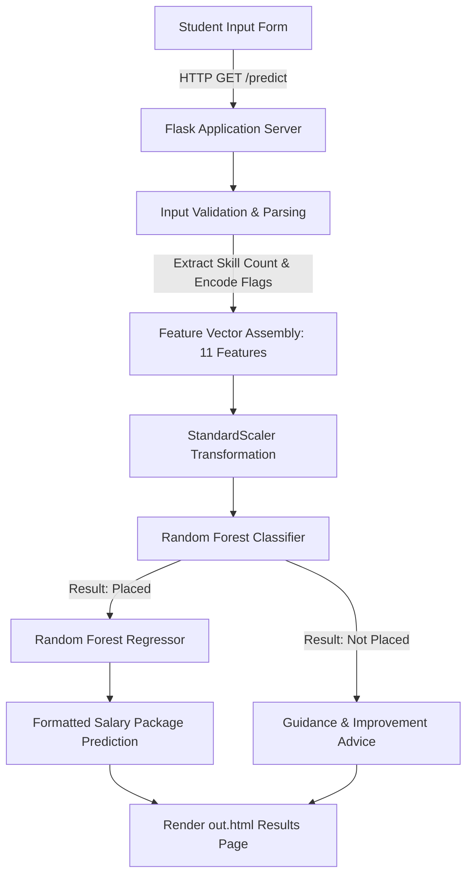

# 🎓 Campus Recruitment & Salary Prediction System

[](https://www.python.org/)
[](https://flask.palletsprojects.com/)
[](https://scikit-learn.org/)
[](https://opensource.org/licenses/MIT)

An end-to-end Machine Learning web application that predicts a student's campus placement probability and forecasts their expected annual package (CTC) based on academic records, technical proficiencies, internships, and extracurricular achievements.

---

## 📌 Table of Contents

- [Overview](#-overview)
- [Key Features](#-key-features)
- [System Architecture](#-system-architecture)
- [Machine Learning Models & Metrics](#-machine-learning-models--metrics)
- [Project Structure](#-project-structure)
- [Input Features](#-input-features)
- [Installation & Setup](#-installation--setup)
- [Usage](#-usage)
- [Technologies Used](#-technologies-used)
- [Future Enhancements](#-future-enhancements)
- [Author & License](#-author--license)

---

## 📖 Overview

Campus placement is a critical milestone for engineering and college graduates. This predictive system assists students and placement training cells in:
1. **Assessing Placement Readiness**: Classifying whether a candidate has a high probability of securing a placement offer based on historical recruitment patterns.
2. **Salary Package Estimation**: Estimating potential annual salary offers (INR) for qualified candidates to set realistic industry benchmarks.
3. **Actionable Feedback**: Highlighting areas for growth if placement readiness is low (e.g., skill accumulation, backlog clearance, or project work).

---

## ✨ Key Features

- **Dual-Model Inference Pipeline**:
  - **Stage 1 (Classification)**: Determines placement eligibility (`Placed` vs `Not Placed`).
  - **Stage 2 (Regression)**: Predicts expected annual CTC for candidates identified as eligible for placement.
- **Robust Feature Preprocessing**: Inputs are normalized via pre-fitted `StandardScaler` objects bundled directly with model artifacts to prevent data leakage and skewness.
- **Interactive & Responsive UI**: Clean web portal styled with custom CSS across multiple views (Home, About, Assessment Portal, and Results Summary).
- **Auto-Browser Launch**: Built-in automatic browser invocation on execution, running on dedicated port `5001` to eliminate macOS AirPlay / port 5000 collisions.

---

## 🏗 System Architecture



---

## 🧠 Machine Learning Models & Metrics

The system utilizes hyperparameter-tuned ensemble models trained using `GridSearchCV` on over 10,000 historical student recruitment records.

| Model Task | Algorithm | Key Hyperparameters | Test Metric |
| :--- | :--- | :--- | :--- |
| **Placement Status** | **Random Forest Classifier** | `n_estimators: 300`, `criterion: gini`, `min_samples_split: 5`, `stratified split` | **94.50% Accuracy** (F1-Score: 0.94) |
| **Salary Estimation** | **Random Forest Regressor** | `n_estimators: 500`, `max_depth: 10`, `min_samples_split: 10`, `bootstrap: True` | **R² Score: 0.912** (MAE: ~₹64,395) |

---

## 📁 Project Structure

```text
├── app.py                          # Main Flask web application and inference routing
├── requirements.txt                # Python package dependencies
├── placement_model.pkl             # Bundled classifier model + StandardScaler
├── salary_model.pkl                # Bundled regressor model + StandardScaler
├── data/
│   ├── Placement_Prediction.py     # Training & hyperparameter tuning pipeline for placement
│   ├── Salary_prediction.py        # Training & hyperparameter tuning pipeline for salary
│   ├── Placement_Prediction_data.csv # Recruitment dataset (10,000+ entries)
│   ├── Salary_prediction_data.csv    # CTC dataset for placed candidates
│   └── PreProcessing.ipynb         # Exploratory data analysis (EDA) notebook
├── templates/
│   ├── home.html                   # Landing page
│   ├── about.html                  # Project background & methodology
│   ├── index.html                  # Assessment form interface
│   └── out.html                    # Prediction result presentation page
└── static/
    ├── css/                        # Custom stylesheets (style.css, style1-3.css)
    └── images/                     # Graphic assets & banners
```

---

## 📊 Input Features

The models evaluate candidates across 11 key academic and profile dimensions:

| Feature Name | Type | Description |
| :--- | :--- | :--- |
| **CGPA** | Numeric (Float) | Cumulative Grade Point Average (scale 0.0 - 10.0) |
| **Major Projects** | Integer | Number of comprehensive final-year / capstone projects completed |
| **Workshops / Certs** | Integer | Verified certifications or industry workshops attended |
| **Mini Projects** | Integer | Semester / minor projects completed |
| **Technical Skills** | Comma-delimited | Automatically parsed to calculate overall skill count |
| **Communication Rating** | Float (0.0 - 10.0) | Soft skills / interview proficiency score |
| **Internship** | Binary (Yes / No) | Industry exposure & professional work experience |
| **Hackathons** | Binary (Yes / No) | Competitive programming or hackathon participation |
| **12th Percentage** | Float (0 - 100%) | Higher secondary academic percentage |
| **10th Percentage** | Float (0 - 100%) | Secondary school academic percentage |
| **Active Backlogs** | Integer | Number of uncleared backlogs / standing arrears |

---

## ⚙️ Installation & Setup

### Prerequisites
- Python 3.8 or higher installed on your system.
- `pip` package manager.
- Git.

### 1. Clone the Repository
```bash
git clone https://github.com/PAVAN-KUMAR572/Campus-Recruitment-Prediction-System.git
cd Campus-Recruitment-Prediction-System
```

### 2. Create and Activate a Virtual Environment
```bash
# macOS / Linux
python3 -m venv .venv
source .venv/bin/activate

# Windows
python -m venv .venv
.venv\Scripts\activate
```

### 3. Install Dependencies
```bash
pip install -r requirements.txt
```

### 4. (Optional) Re-train or Fine-Tune the Models
If you wish to re-train the models with custom or updated data:
```bash
python3 data/Placement_Prediction.py
python3 data/Salary_prediction.py
```

---

## 🚀 Usage

Run the Flask application:
```bash
python3 app.py
```

- The app starts automatically on **`http://127.0.0.1:5001`** and opens directly in your default web browser.
- Navigate to the **Prediction Portal** (`/index`), fill in your profile credentials, and click **Predict Placement**.
- View your personalized placement assessment and forecasted annual package.

---

## 🛠 Technologies Used

- **Language**: Python 3
- **Web Framework**: Flask, Jinja2
- **Machine Learning**: Scikit-Learn (Random Forest Classifier & Regressor, GridSearchCV, StandardScaler)
- **Data Manipulation**: Pandas, NumPy
- **Data Visualization & EDA**: Matplotlib, Seaborn
- **Frontend**: HTML5, CSS3, Google Fonts (Montserrat & Roboto)

---

## 🔮 Future Enhancements

- [ ] Add role-specific career recommendation (e.g., SDE, Data Analyst, Cloud Engineer).
- [ ] Integration of resume parsing (PDF to automated profile extraction via NLP).
- [ ] Student dashboard tracking semester-by-semester progress.
- [ ] Migration from form GET requests to secure RESTful POST API endpoints with JSON responses.

---

## 📄 License

This project is licensed under the **MIT License** - see the [LICENSE](LICENSE) file for details.
